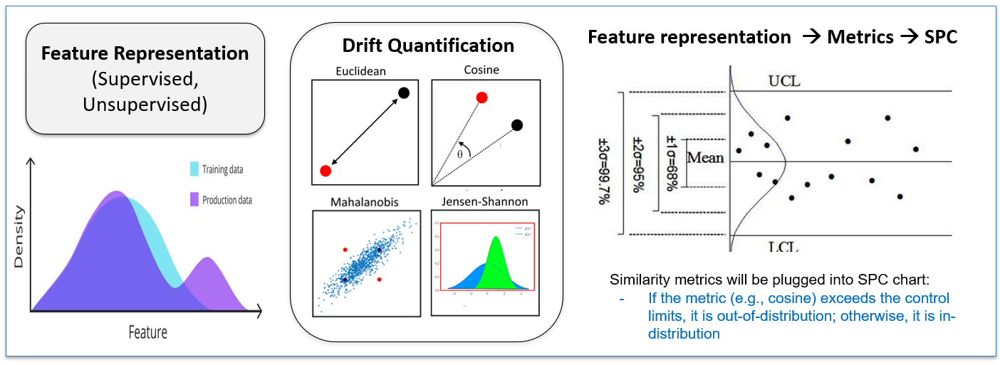

# DataMonitor

**A pipeline for out-of-distribution (OOD) detection and data-drift monitoring on medical imaging, using statistical process control (SPC).**

DataMonitor trains feature extractors on an in-distribution medical-image view, scores new images by their similarity or distance to that reference, and flags anomalies with SPC control charts. It then simulates a gradual distribution shift and detects the change point with a CUSUM chart. The repository runs one end-to-end experiment, reproducing the paper's master results table ("Table 3"), its seed × batch-size figure ("Figure 2"), and its drift figure ("Figure 3").

---

## What the pipeline does

The experiment crosses three feature extractors with four scoring metrics on the MedMNIST AbdominalCT dataset. The in-distribution class is one CT view (axial, `organamnist`); the off-axis views (coronal `organcmnist`, sagittal `organsmnist`) are out-of-distribution.

| Stage | Entrypoint | Output |
| --- | --- | --- |
| 1. Setup | `datamonitor.sh` | virtual environment, `cfg.json` |
| 2. Train | `train.py` | three feature-extractor checkpoints |
| 3. Extract | `get_features.py` | cached feature matrices per data split |
| 4. Evaluate | `ood_detection.py`, `merge_results.py` | bootstrap detection table + control charts + CUSUM drift figure |

`./datamonitor.sh` runs a single full pipeline. To run many pipelines (one per seed/batch-size pair) in parallel and merge them into one master table, use `./sweep.sh`.

---

## Quick start

```bash
# 1. Configure the run by editing .env (key settings: VENV_DIR, DATA_DIR,
#    BATCH_SIZE, DM_SEED, EPOCHS).

# 2. Run the full pipeline from scratch (venv, train, extract, evaluate):
./datamonitor.sh

# 3. Already have checkpoints? Skip training:
RUN_TRAIN=0 ./datamonitor.sh

# 4. Iterating on a metric? Re-run only evaluation against cached features:
RUN_SETUP=0 RUN_TRAIN=0 RUN_EXTRACT=0 ./datamonitor.sh

# 5. Sweep many runs in parallel, then merge into the master table:
./sweep.sh 2001:128 2002:128 2001:256 2002:256
```

Each stage is gated by a `RUN_<STAGE>=1/0` toggle, so the pipeline can be re-entered at any point. See [Architecture](./Documentation/Architecture.md) for the orchestration details.

---

## Repository layout

```
DataMonitor/
├── datamonitor.sh              # orchestrator: the four-stage pipeline
├── sweep.sh                    # parallel multi-run driver (wraps datamonitor.sh)
├── .env                        # machine configuration (documented template)
├── requirements.lock.txt       # frozen dependency versions (installed from)
├── requirements.txt            # original upstream pins, for reference only
│
├── train.py                    # stage 2: train one extractor
├── get_features.py             # stage 3: cache feature matrices
├── ood_detection.py            # stage 4a: score + bootstrap one (method, metric)
├── merge_results.py            # stage 4: master-table builder + terminal renderer
├── plot_seed_batch.py          # seed × batch-size analysis figure
├── utils.py                    # run_name / make_run_dir / set_seed
│
├── datasets/                   # load_data, matrixify; the AbdominalCT dataset class
├── feature_methods/            # the three extractors + a small bridge/registry layer
│   └── src/                    #   (see Detection.md for the layout)
├── SPC_Charts/                 # simulate_data_shift + CUSUMChangeDetector (upstream)
└── figs/DataMonitor.png        # conceptual overview figure
```

Generated at run time (git-ignored): `data/`, `model_saves/`, `numpy_files/`, `results/`, `figures/`, `logs/`, the virtual environment, and `cfg.json`.

---

## Documentation

| Guide | Contents |
| --- | --- |
| [Installation](./Documentation/Installation.md) | Prerequisites, the virtual environment, the lockfile, `.env` configuration, and the known config inconsistencies. |
| [Architecture](./Documentation/Architecture.md) | The run-key convention, the four-stage data flow and artifact tree, and the `datamonitor.sh`/`sweep.sh` internals. |
| [Feature Extraction & Detection](./Documentation/Detection.md) | The three feature extractors and the OOD scoring core: the Mahalanobis numerical variants, SPC rules, and the bootstrap. |
| [Data-Drift Monitoring](./Documentation/Data-Drift-Monitoring.md) | The SPC charts, the CUSUM detector, and the drift simulation. |
| [Results](./Documentation/Results.md) | Reproducing results. |

---

## Data-monitoring overview



*Feature representation, then metric, then SPC: a feature extractor maps each image to an embedding, a metric scores it against the in-distribution reference, and a score outside the SPC control limits is flagged out-of-distribution.*

## Citation

If you use **DataMonitor** in your work, please cite:

> Zamzmi, Ghada, et al. "Out-of-Distribution Detection and Radiological Data Monitoring Using Statistical Process Control." *Journal of Imaging Informatics in Medicine* (2024): 1-19.

## Repository

The source code is maintained by DIDSR: [github.com/DIDSR/DataMonitor](https://github.com/DIDSR/DataMonitor). Use the issue tracker to report bugs, request features, or ask questions.
